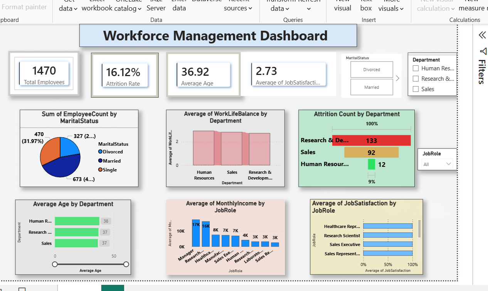

## HR Analytics Power BI Dashboard

## Project Overview

This project demonstrates a beginner-friendly HR Analytics workflow using SQL and Power BI. The goal is to analyze employee data and build an interactive dashboard that provides meaningful business insights.

## Project Workflow

### Step 1: Data Cleaning

* Cleaned the HR dataset.
* Removed duplicate records.
* Checked for missing values.
* Prepared the data for analysis.

### Step 2: SQL Analysis

Performed SQL queries from basic to intermediate level including:

* SELECT
* WHERE
* ORDER BY
* GROUP BY
* Aggregate Functions
* CASE Statements

### Step 3: Power BI Dashboard

Created an interactive dashboard to analyze:

* Total Employees
* Attrition Count
* Job Satisfaction
* Distance from Home
* Performance Rating
* Employee Distribution

## Tools Used

* SQL
* Power BI
* Microsoft Excel
* DAX

## Skills Demonstrated

* Data Cleaning
* SQL Queries
* Data Visualization
* Dashboard Design
* Basic DAX

  ## Dashboard Preview

